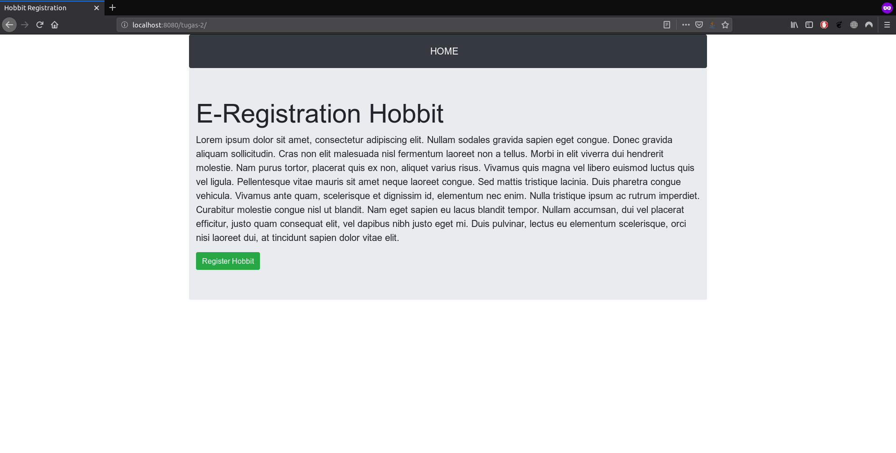
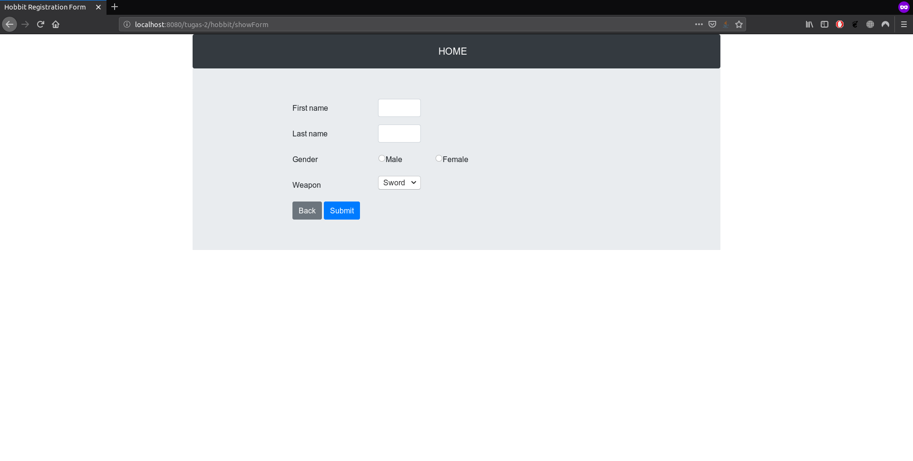
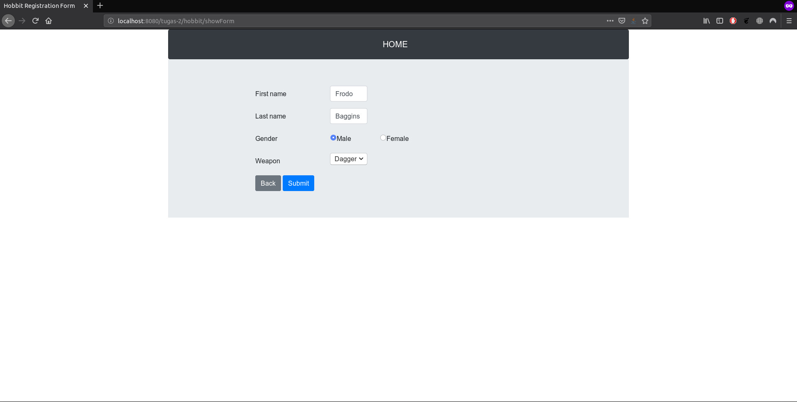
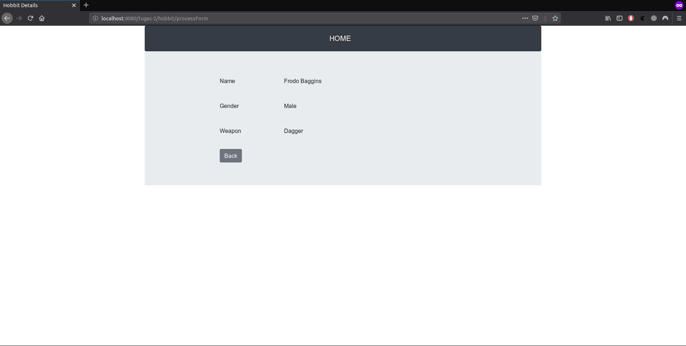

# Spring MVC

Tugas 2 PBKK

## Outline
- [Spring MVC](#spring-mvc)
- [Outline](#outline)
- [Tujuan](#tujuan)
- [Setting Spring MVC](#setting-spring-mvc)
- [Testing](#testing)

## Tujuan

Implementasi Spring MVC. Membuat form pendaftaran hobbit dan menampilkan data yang dimasukkan.

## Setting Spring MVC

1. Setelah membuat project Spring MVC, download file [disini](https://www.luv2code.com/downloads/udemy-spring-hibernate/solution-code-spring-mvc-config-files.zip)
2. Copy file di directory config ke directory WebContent/WEB-INF.
3. Copy file di copy `javax.servlet.jsp.jstl-1.2.1.jar` dan `javax.servlet.jsp.jstl-api-1.2.1.jar` ke directory WebContent/WEB-INF/lib
4. Ganti base-package pada `spring-mvc-demo-servlet.xml` sesuai kebutuhan
5. Copy semua library spring pada WebContent/WEB-INF/lib
6. Tambahkan `	<mvc:resources mapping="/resources/**" location="/resources/"></mvc:resources>` di file `web.xml` agar bisa menggunakan resource seperti css, gambar dan javascript
7. Membuat directory `resources/css` `resources/images` `resources/js`
8. Jangan lupa membuat server tomcat 8 terlebih dahulu

### Testing

Berikut screenshot tampilan web
1. Halaman awal

2. Halaman isi form

3. Hasil form
